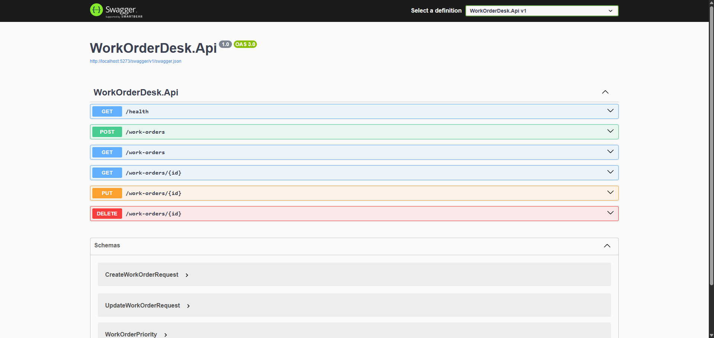

# Work Order Desk API

Backend service for the Work Order Desk application.

This project demonstrates a layered architecture using:

- ASP.NET Core (.NET 8)
- Entity Framework Core (SQLite)
- Clean Architecture principles
- Minimal APIs

---

## 🖼️ Screenshots

## 

## 🧱 Architecture

The solution is organized into distinct layers:

- **Domain**
  - Core business rules and entities
  - Enforces invariants (e.g., status transitions, validation)

- **Application**
  - Use cases (commands, queries, handlers)
  - Defines abstractions (repositories)
  - No dependency on infrastructure or HTTP

- **Infrastructure**
  - EF Core persistence
  - Repository implementations
  - Database configuration and mappings

- **API**
  - HTTP endpoints (Minimal API)
  - Request/response DTOs
  - Middleware (error handling, CORS)

---

## ⚙️ Tech Stack

- .NET 8
- ASP.NET Core (Minimal APIs)
- Entity Framework Core
- SQLite

---

## 🚀 Running Locally

```bash
dotnet build
dotnet run --project WorkOrderDesk.Api
The API will start on: The API will start on: https://localhost:5173

## Commit Message Convention

This project follows a simplified Conventional Commits format:

```

type(scope): short summary

```

### Eamples

```

chore: initialize solution and EF setup
feat(workorders): add WorkOrder domain model
feat(api): add create work order endpoint
fix(infrastructure): correct DbContext configuration
refactor(application): extract validation logic
docs: update README with architecture overview
test(domain): add WorkOrder validation tests

```

## CHANGELOG Policy

This project maintains a manual `CAHNGELOG.md`

Each merge request must:

1. Include a small entry in the Unreleased section
2. Following this format

```

## [Unreleased]

### Added

- WorkOrder domain model
- CreateWorkOrder endpoint

### Changed

- Refactored validation logic

### Fixed

- Corrected SQLite migration error

```

When preparing a release, `unreleased` becomes a version:

```

## [0.1.0] - 2026-02-23

### Added

- Initial layered architecture
- EF Core setup with SQLite
- Health endpoint

```

## Versioning Strategy

We follow Semantic **rsioning (SemVer)**

MAJOR.MINOR.PATCH
```
